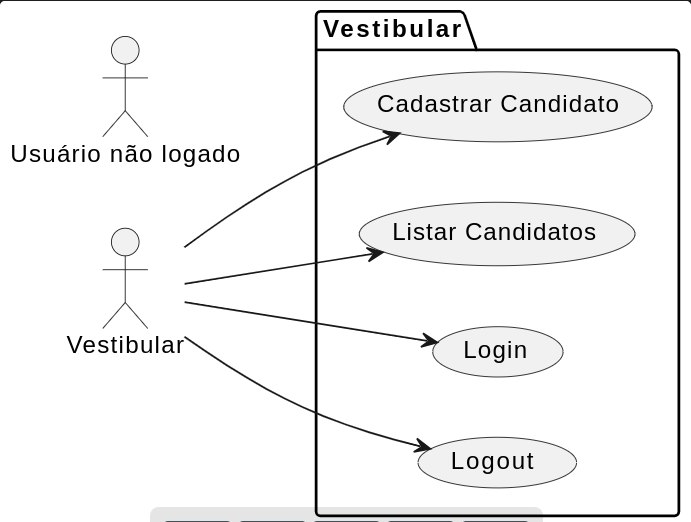

## Segunda Avaliação DESENVOLVIMENTO WEB II

## Como Realizar esta avaliação ?

1. Crie um repositório no seu github com o nome "<b>FATEC_DES_WEB2_2024_Avaliacao2</b>"

2. Publicar no Teams o arquivo zipado (.zip) do seu diretório avaliacao2. Este anexo será avaliado pelo professor Orlando.<del> Publicar no Teams o repositório que será avaliado pelo professor Orlando.</del> Publicar sua prova no seu github como portifólio.

##  Desafio Técnico

Crie um cadastro em PHP para os candidatos do vestibular Fatec Araras. Os campos que devem estar cadastrados são: 

 - Nome Completo (varchar[100] )
 - Curso (inteiro)
 - - 1 para DSM
 - - 2 para GE

O arquivo com o dump do banco de dados está disponível no arquivo <b>vestibular.sql</b>
O seguinte diagrama de caso de uso ilustra as funcionalidades do sistema. 

Os casos de uso Login e Logout estão implementados de forma orientada a objetos. O modelo encontra-se no diretório code. Para estas funcionalidades, fez-se uso da classe Login (presente em classes.php)

Para testes:
- Login: <b>vestibular</b>
- Senha: <b>fatec</b>

### 1- Classe Cadastro (40% da nota)
- Toda a manipulação de dados no banco de dados deve ocorrer dentro da classe Cadastro. Esta classe deve ser criada dentro do arquivo <b>classes.php</b>.
- No método construtor, deve ser criado a conexão com o banco de dados MySQL 
- No método destrutor a conexão precisa ser fechada. 
- Os demais métodos, você deve criar com os nomes e argumentos que julgar apropriados.

### 2- Cadastrar Candidato (30% da nota)
- Cadastrar os campos supracitados no banco de dados MySQL. <b>Será possível realizar o cadastro somente em uma sessão ativa</b>.

- Seu sistema terá um botão "Cadastrar candidato" (arquivo home.php) que irá direcionar a uma página para o recebimento dos parâmetros.

- Os dados recebidos via input devem ser passado como parâmetros dos métodos da classe criada por você ( classe Cadastro).

### 3- Ler todos os candidatos cadastrados (30% da nota)
- <b>Em uma área de sessão</b>, permitir ler todos os candidatos cadastrados no banco de dados. Caso não esteja em uma sessão ativa, redirecionar para a área de login.

- Seu sistema terá um botão "Visualizar candidatos" ( arquivo home.php). Ao clicar, deve carregar uma página php, que irá acessar todos os candidatos cadastrados e e apresentar ao usuário logado.

## Considerações sobre o código

- PHP Orientado a objetos.
- Acesso ao MySQL: Faça uso do PDO encapsulado na classe Cadastro.

## Critérios de avaliação

- Entregar todos os quesitos no prazo: 100% da nota.

- Entregar todos os quesitos com atraso: 70% da nota.

- Entregar todos os quesitos fora prazo: 0% da nota.

## Prazo final

Serão considerados <b>no prazo</b> os projetos publicados até o dia 06 de maio de 2024, 22h30.

Serão considerados <b>com atraso</b> os projetos publicados até o dia 07 de abril de 2024, 23hs55.

Serão considerados <b>fora do prazo </b> os projetos publicados posterior ao prazo estipulado anteriormente.

## Considerações Finais

Você pode consultar a documentação oficial, a documentação com o Zeal, os slides e códigos do repositório da nossa sala, e até mesmo conversar com colegas de sala.  
<b>Mas</b> não é permitido copiar o código sem entender o que fez (popular cola). As atividades que forem cola serão zeradas.

 
O professor publicará informes no grupo de Whatsapp abaixo:

https://chat.whatsapp.com/LvGIymKOzQc5BaetmsGmSR

